# Tugas Besar Unity - Wave Survival
Dibuat oleh: **Lukas Kurnia Jonathan / 13517006**

## Deskripsi Program
Aplikasi Survival Game yang dibangun oleh Unity dengan beberapa spesifikasi:
* Terdapat karakter (https://www.gameart2d.com/freebies.html) pada game ini. Karakter dapat berjalan, menembakan senjata, dan lompat. Pergerakan karakter harus mengikuti hukum fisika (collider, rigidbody).
* Karakter digerakan dengan menggunakan keyboard. 
* Terdapat sound effect pada saat karakter menembak.
* Pergerakan kamera mengikuti pergerakan karakter.
* Terdapat animasi pada pergerakan karakter. Berikan animasi karakter pada saat bergerak, menembak, dan loncat. 
* Generate zombie yang merupakan musuh. Jika pemain bersentuhan dengan zombie, maka darah pemain berkurang. Lokasi zombie dimunculkan dibebaskan.
* Karakter awalnya mempunyai darah bernilai 100. Permainan berhenti ketika darah pemain mencapai 0.
* Design dari peta permainan dibebaskan. Buatlah sekreatif mungkin.
* Game menyimpan score dari pemain. Pemain mendapatkan score ketika membunuh lawan. Tampilan score tersebut pada layar.
* Simpanlah score pada suatu basis data online. Gunakanlah HTTP request untuk mendapatkan data scoreboard dan melakukan update scoreboard. Pada saat karakter mati, game akan meminta username pemain untuk melakukan update terhadap scoreboard. (Server untuk melakukan operasi ini disediakan oleh asisten).
* Selain scene permainan, terdapat juga scene Main Menu dan Scoreboard. Gunakanlah canvas dan layout panel untuk kedua scene tersebut.
* Gunakanlah PlayerPrefs untuk menyimpan setting permainan, seperti audio di-enable atau tidak.
* Assets yang digunakan bebas asalkan dalam 2D. Karakter dan musuh tidak harus sesuai dengan deskripsi game.
* Game dibuat dalam aplikasi desktop.

## Cara kerja Aplikasi
Pada saat aplikasi dibuka maka akan ditampilkan `Main Menu`. Pada bagian ini, pemain dapat mulai game dengan tombol `Play Game`, keluar dari permainan dengan tombol `Quit`, melihat `Scoreboard` yang diambil dari server dengan urutan tertinggi ke rendah, serta menyalakan atau mematikan suara dengan tombol `Turn On Sound / Turn Off Sound` tergantung preferensi pemain.

Ketika pemain memulai game, maka akan ditampilkan `Peta` permainan dan seorang `Player` yang dapat bergerak. Pergerakkan untuk player antara lain:

* Tombol `Left dan Right` untuk move kiri dan kanan
* Tombol `Space atau W` untuk melompat
* Tombol `Ctrl atau Left Mouse Button` untuk menembak.

Setiap pergerakkan player akan dimunculkan animasinya seperti `Running, Jumping, Shooting, Idle, dan Dead`. Setiap kali player bergerak akan diikuti oleh sebuah `kamera`. 

Karakter permainan memiliki `Health` bernilai `100`. Pemain akan kehilangan health ketika bersentuhan/diserang oleh `zombie`. Zombie dimunculkan secara random di seluruh peta dengan `interval waktu tertentu`.

Pemain dapat membunuh zombie dengan cara menembak zombie hingga mati. Ketika zombie mati, pemain akan mendapatkan `skor 100`. Sama seperti pemain, zombie juga memiliki animasi pergerakkan yang serupa.

Ketika pemain mati, maka game berakhir dan dimunculkan `menu game over`. Pemain dapat menuliskan username ny untuk `melakukan update pada basis data scoreboard dari server`.

## Library / Assets
Pada aplikasi ini beberapa library atau asset yang digunakan berasal dari `freebies` untuk karakter player, zombie, dan tilemap peta. Untuk audio gunshot diambil dari `post apocalypse guns demo`. Bullet diambil dari `wave survival assets` dan Audio BGM diambil dari `Alien Shooter`.

### TextMeshPro
Digunakan untuk menampilkan text dengan desain dan kemampuan yang lebih bagus dibandingkan UI Text biasa di Unity. Text dapat diatur shadow, ketebalan, dan pengaturan lainnya lebih mudah. Pada aplikasi ini digunakan untuk text dan Input Text user

### Cinemachine Virtual Camera
Digunakan untuk memudahkan penggunaan kamera mampu mengikuti user dengan memainkan deadzone, softzone, dan damping.

### JSON Utility 
Digunakan untuk melakukan deserialization terhadap text json yang diambil dari server `Host: 134.209.97.218:5051`

## Screenshot aplikasi
* **Game Play**

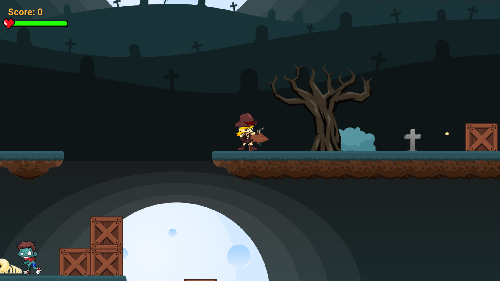

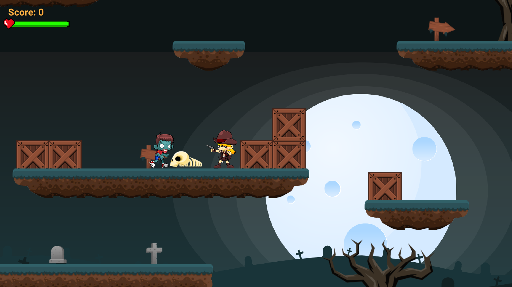

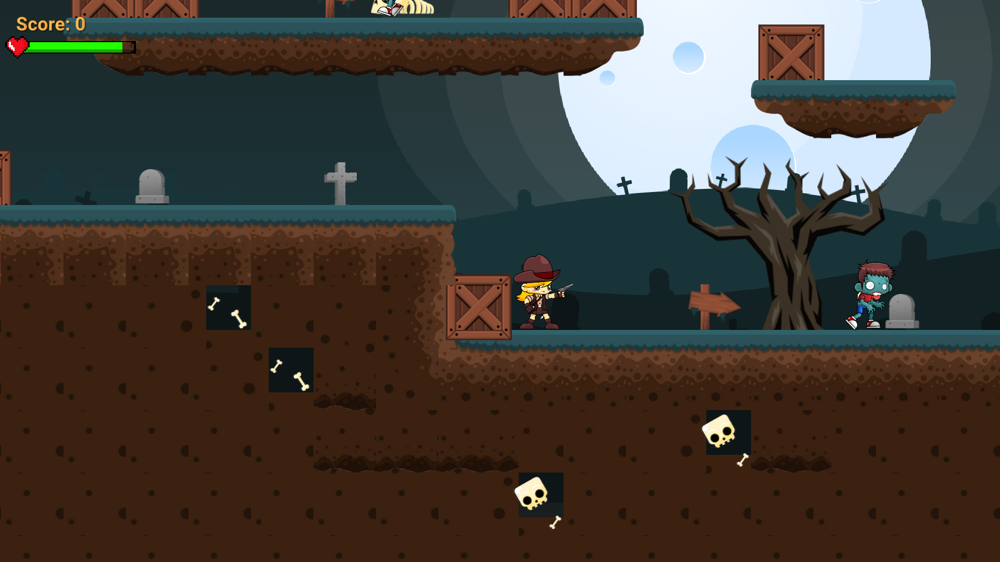

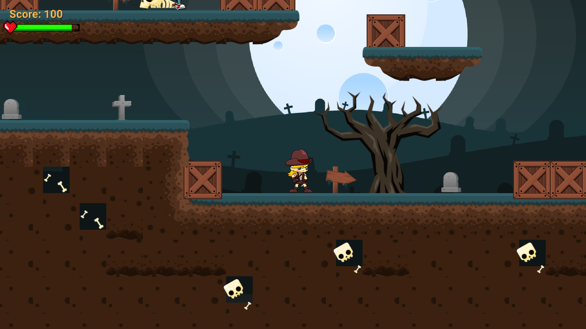

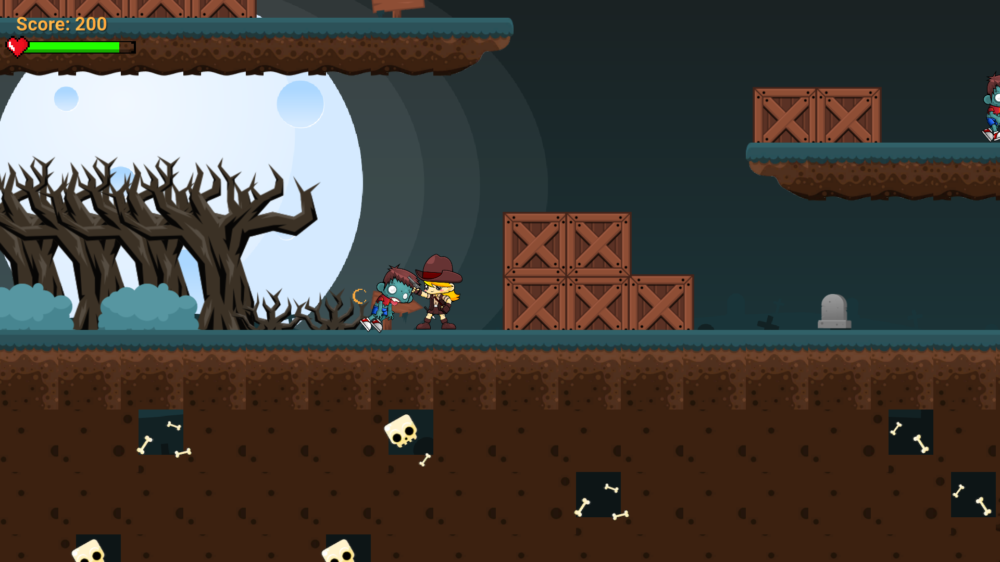

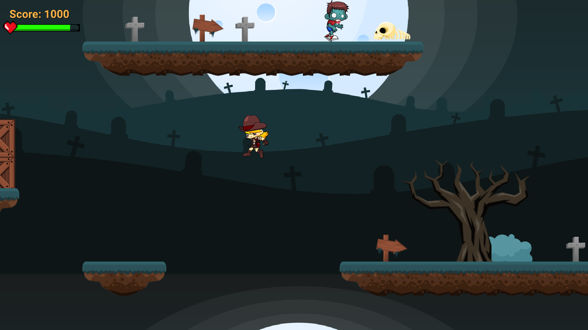

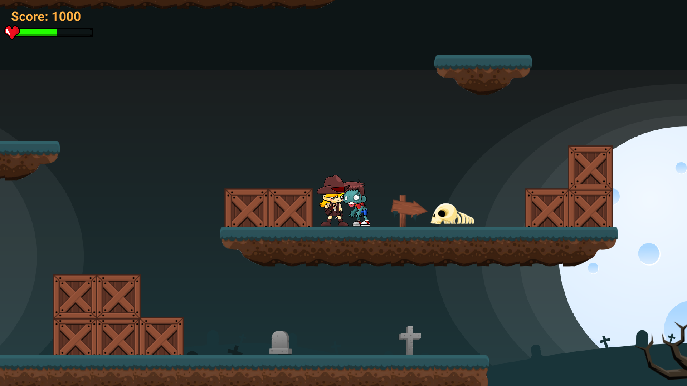

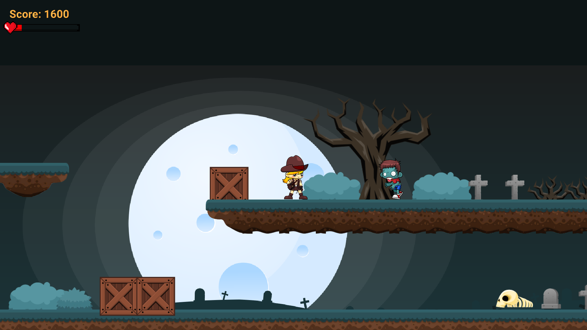

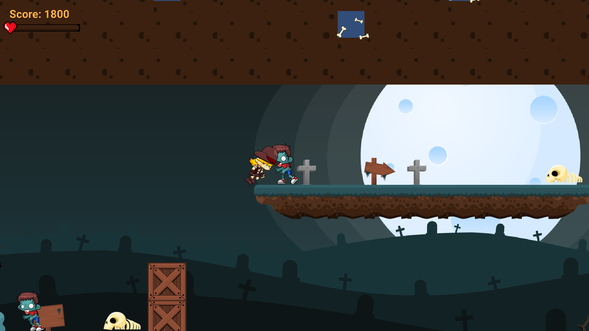

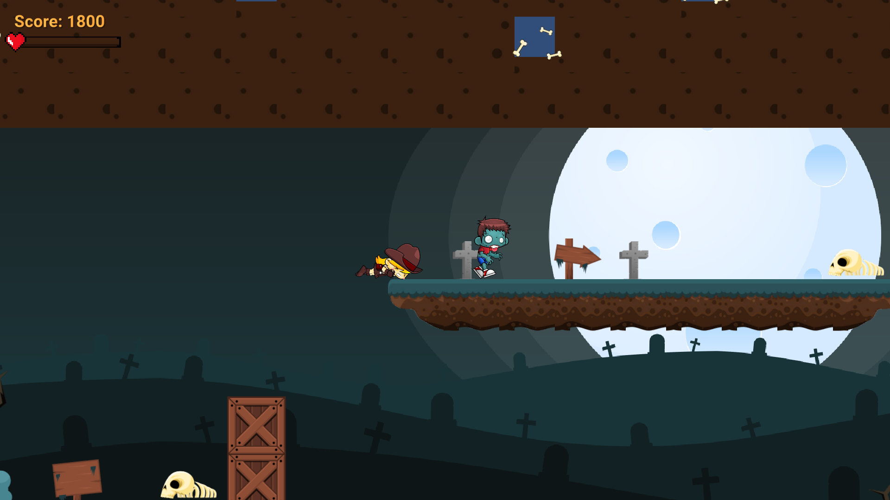

* **Main Menu**

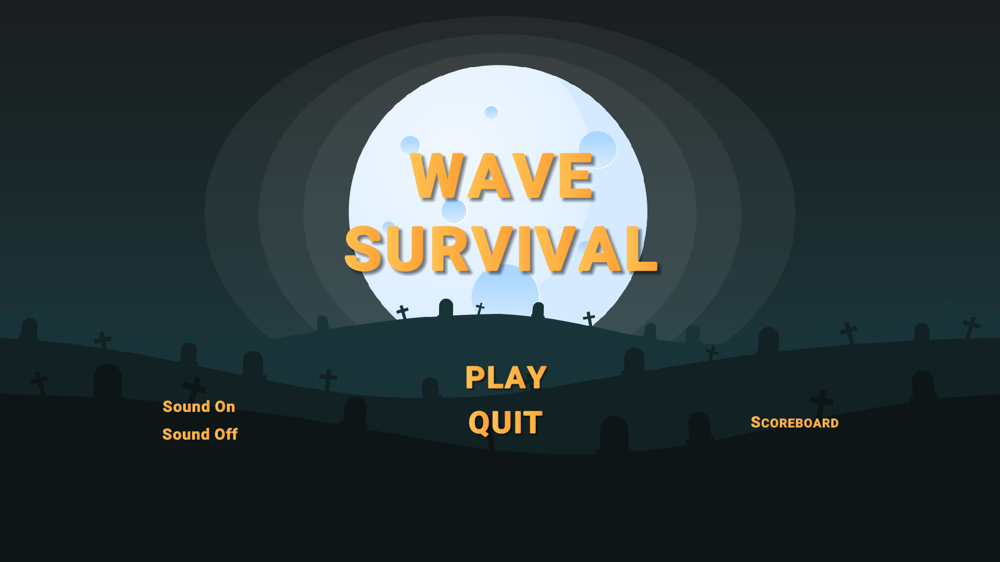

* **Game Over**

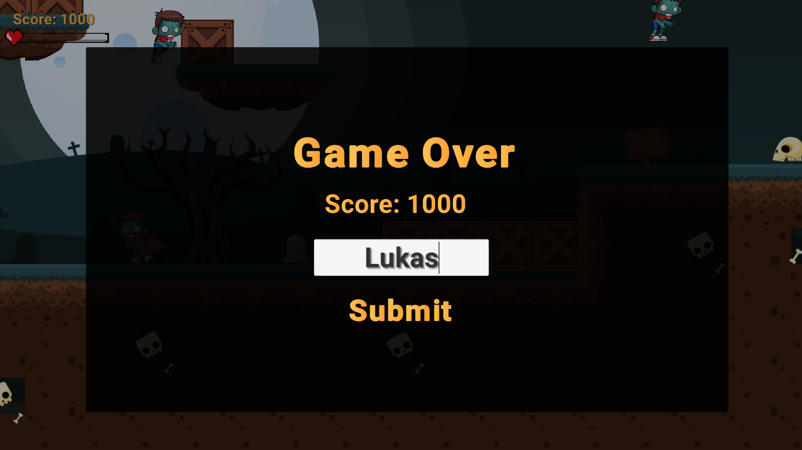

* **Score Board**

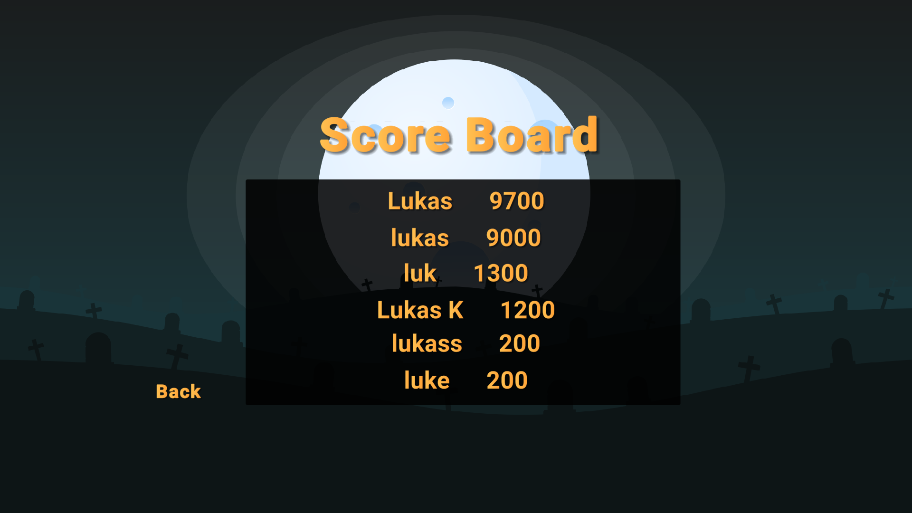